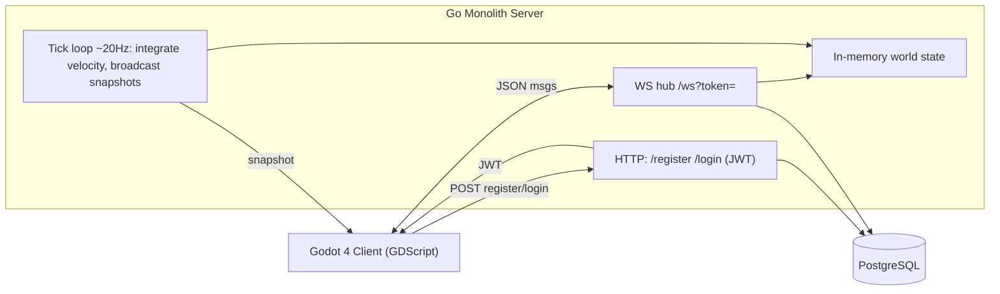

# DEATHBORN — Walking Skeleton + MVP Roadmap

## Goal of this milestone (M0)

A player can: register / log in (email+password) → create a character → enter the persistent world → move freely with velocity-based input → see other connected players move in real time. The server is fully authoritative for position. Combat, gathering, permadeath, etc. are intentionally deferred and documented in the roadmap.

Decisions locked from clarifications: email+password first (schema OAuth-ready), JSON over WebSocket, full-MVP captured in markdown for later plans.

## Architecture (M0)

- Server-authoritative: client sends only desired input (movement direction); server integrates position each tick and broadcasts authoritative positions. Client interpolates.
- WS auth: HTTP login returns a JWT; client connects `/ws?token=...`; server validates, loads account, finds-or-creates the account's single active character.

## Repo layout

- `server/` — Go monolith
  - `cmd/deathborn/main.go` — entrypoint, wires config/db/http/ws/loop
  - `internal/config/` — env config (`DATABASE_URL`, `JWT_SECRET`, `PORT`)
  - `internal/db/` — pgx pool + queries (accounts, characters)
  - `internal/auth/` — bcrypt hashing, JWT issue/verify, register/login HTTP handlers
  - `internal/net/` — WS hub, per-client read/write pumps, JSON protocol (`protocol.go`)
  - `internal/game/` — `world.go`, `player.go`, `loop.go` (tick simulation)
  - `migrations/0001_init.sql` — schema
  - `go.mod`
- `client/` — Godot 4 project
  - `project.godot`, `autoload/Net.gd` (singleton: HTTPRequest + WebSocketPeer)
  - `scenes/Login.tscn`+`.gd`, `CharacterCreate.tscn`+`.gd`, `World.tscn`+`.gd`
  - `scripts/Player.gd` (remote/local player node with interpolation)
- Root: `docker-compose.yml`, `.env.example`, `.gitignore`, `README.md`, `docs/MVP_ROADMAP.md`

## Database schema (OAuth-ready)

- `accounts(id, email UNIQUE, password_hash NULLABLE, created_at)` — `password_hash` nullable so OAuth-only accounts work later.
- `oauth_identities(id, account_id FK, provider, provider_user_id, UNIQUE(provider, provider_user_id))` — created now but unused, so adding Google later needs no migration.
- `characters(id, account_id FK, name, alive BOOL, pos_x, pos_y, created_at)` — partial unique index enforcing one `alive=true` character per account.
- `character_history` and `highscores` — created as empty tables now (used in later milestones), so persistence layer is stable.

Migration approach: plain `.sql` files run on startup via a tiny idempotent runner (tracked in a `schema_migrations` table). Tradeoff: less tooling than golang-migrate, simplest for solo dev; can swap to golang-migrate later.

## JSON protocol (M0)

Envelope: `{ "type": string, "data": {...} }`.
- Client→Server: `input` `{dirX, dirY}` (normalized desired direction); `create_character` `{name}`.
- Server→Client: `welcome` `{characterId, x, y}`; `snapshot` `{tick, players:[{id,name,x,y}]}`; `error` `{message}`.
Server clamps speed (e.g. 120 px/s) and integrates per tick.

## Roadmap file (full MVP, deferred)

`docs/MVP_ROADMAP.md` — ordered milestones with feature checklists so future plans pick up cleanly:
- M0 Walking skeleton (this milestone)
- M1 Global chat
- M2 World zones (Town/Forest/Mine/Lake/Wilderness) + safe-zone flags
- M3 Resource gathering + usage-based skill XP/levels
- M4 Real-time combat (attack/strength/defense/hitpoints)
- M5 Permadeath: drop full inventory+equipment to world, delete active character
- M6 Full-loot looting of dropped items
- M7 Character death history snapshots
- M8 Account highscores / leaderboards
- M9 Google OAuth login
Each milestone lists server packages, protocol messages, DB tables, and client scenes touched.

## Verification

- `docker compose up` starts Postgres + server; migrations apply.
- `curl` register+login returns JWT.
- Run Godot client twice (two instances) → both authenticate, create characters, and each sees the other move smoothly in the world scene.