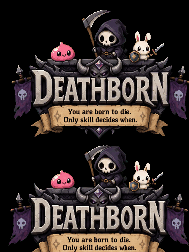
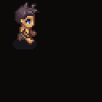

<p align="center">
  
</p>

# DEATHBORN

> You are born to die. Only skill decides when.

A top-down 2D real-time sandbox MMORPG: permadeath, full-loot, PvP-driven survival.
The server is fully authoritative; the client only sends input and renders state.

This repository currently contains the **Walking Skeleton (M0)** — the thinnest
end-to-end vertical slice. See [docs/MVP_ROADMAP.md](docs/MVP_ROADMAP.md) for the
full phased plan toward the MVP.

<p align="center">
  
</p>

<p align="center"><em>“Run like you’ve got another life — you don’t.”</em></p>

## What works today (M0)

- Register / log in with email + password (HTTP, returns a JWT).
- Create a character (one active character per account).
- Connect to the world over WebSocket and move freely (velocity-based).
- See other connected players move in real time.
- Server-authoritative position: the client sends only an input direction; the
  server integrates positions on a fixed tick and broadcasts snapshots.
- Hotbar (keys 1–9, 0), interactables (click or E), remember-me login.

## Tech stack

| Layer | Technology | Language |
| --- | --- | --- |
| **Client** | MonoGame 3.8 (DesktopGL), .NET 8 | **C#** |
| **Server** | Go monolith, WebSocket, fixed-tick loop | **Go** |
| **Database** | PostgreSQL (pgx) | SQL |
| **Infra** | Docker + Docker Compose | — |

The **client is C#** — all gameplay UI, rendering, and networking are plain C# classes (no scene editor). The **server is Go**.

## Layout

```
server/                     Go authoritative game server
client/
  Deathborn.Client.sln
  Deathborn.Client/         MonoGame C# client
    Net/GameClient.cs       HTTP auth + WebSocket
    Screens/                Login, CharacterCreate, World
    Game/                   players, interactables, hotbar
docs/MVP_ROADMAP.md         phased roadmap toward full MVP
Taskfile.yml                task runner (server + client commands)
```

## Running the server

### With Docker (recommended)

```bash
task up
# or: docker compose up --build -d
```

PostgreSQL + Go server start on `http://localhost:8080`. Migrations run on startup.

### Locally (server on host, DB in Docker)

```bash
task db
task dev
```

### Smoke-test auth

```bash
curl -s -X POST localhost:8080/register \
  -H 'Content-Type: application/json' \
  -d '{"email":"a@b.com","password":"hunter2"}'
```

## Running the client

**Requires [.NET 8 SDK](https://dotnet.microsoft.com/download).**

1. Start local dev (database + server + client):

```bash
task dev
```

Or run backend and frontend in **separate terminals**:

```bash
task dev:server    # terminal 1
task dev:client    # terminal 2
```

For Docker-only server (no local client): `task up`

3. Register or log in, create a character, enter the world.
4. **WASD** to move, **E** or **click** to interact, **1–9 / 0** for hotbar.
5. Multiplayer: run a second client instance with another account.

Check **Remember email and password** on the login screen to pre-fill credentials on the next launch.

Server URL: local `127.0.0.1:8080` when a dev server is running, otherwise production — see [Server URL](#server-url) below and [client/README.md](client/README.md).

See [client/README.md](client/README.md) for client-specific details.

## Shipping the client

Build a self-contained release and package it for friends. **You only need the .NET SDK on your machine** — friends do not need .NET installed.

### Quick reference

| Platform | Command | Output | Friends run |
| --- | --- | --- | --- |
| **This OS** | `task client:package` | Windows installer / Linux tar.gz / macOS dmg | See below |
| Windows | `task client:installer` | `dist/Deathborn-*-win-x64-Setup.exe` | Double-click Setup |
| Windows (zip) | `task client:publish:win` | `dist/Deathborn-*-win-x64.zip` | Unzip, run `Deathborn.Client.exe` |
| Linux | `task client:package:linux` | `dist/Deathborn-*-linux-x64.tar.gz` | `tar -xzf … && ./install.sh` |
| macOS | `task client:package:mac` | `dist/Deathborn-*-osx-*.dmg` | Open dmg, drag to Applications |
| Win + Linux | `task client:publish:all` | Both zips | — |

One **linux-x64** build runs on Ubuntu, Fedora, Arch, Mint, Steam Deck desktop mode, etc. (glibc-based 64-bit). macOS needs a separate **Apple Silicon** (`osx-arm64`) vs **Intel** (`osx-x64`) build — use `task client:publish:mac` on the Mac you have, or cut a GitHub release for both.

### Prerequisites (your machine)

- [.NET 8 SDK](https://dotnet.microsoft.com/download)
- [Task](https://taskfile.dev)
- **Windows installer:** [Inno Setup 6](https://jrsoftware.org/isdl.php) — `winget install JRSoftware.InnoSetup`
- **macOS .dmg:** must run `task client:package:mac` **on a Mac** (or use CI)

### Windows — installer (recommended)

```bash
task client:installer
# or: task client:package   (on Windows)
```

Output: `dist/Deathborn-<version>-win-x64-Setup.exe`

Send friends **only that Setup.exe**. Adds Start Menu + desktop shortcut + uninstaller.

### Windows — zip (portable)

```bash
task client:publish:win
```

Output: `dist/Deathborn-<version>-win-x64.zip` — unzip the **whole** folder; do not send only the `.exe`.

### Linux — tar.gz + install script

Works on most distros (single `linux-x64` binary). Can be cross-built from Windows:

```bash
task client:package:linux
```

Friends:

```bash
tar -xzf Deathborn-<version>-linux-x64.tar.gz
./install.sh
deathborn
```

Installs to `~/.local/share/deathborn` with a `deathborn` command and desktop menu entry (no sudo).

### macOS — .dmg

**Build on a Mac only:**

```bash
task client:package:mac
```

Output: `dist/Deathborn-<version>-osx-arm64.dmg` (or `osx-x64` on Intel Macs).

Friends open the dmg and drag **Deathborn.app** to Applications.

For **both** Mac architectures, use GitHub Actions (`task release -- X.Y.Z`) or run `task client:publish:mac:arm64` / `task client:publish:mac:x64` on each machine.

### What friends need

| Item | Windows | Linux | macOS |
| --- | --- | --- | --- |
| .NET installed | No | No | No |
| Your live server | Yes* | Yes* | Yes* |

\*Default production API: `https://api.deathborn.wolfskii.dev` — or set `DEATHBORN_SERVER_URL`.

### Server URL

The client picks a server automatically ([`ServerEndpoints.cs`](client/Deathborn.Client/Net/ServerEndpoints.cs)):

1. `DEATHBORN_SERVER_URL` environment variable, if set
2. `http://127.0.0.1:8080` if `/health` responds (local dev)
3. `https://api.deathborn.wolfskii.dev` (production)

To point a installed build at another host without rebuilding:

```bat
set DEATHBORN_SERVER_URL=https://your-api.example.com
"C:\Program Files\Deathborn\Deathborn.Client.exe"
```

### Installer internals

Scripts live under [`installer/`](installer/):

| Path | Purpose |
| --- | --- |
| `Deathborn.iss` | Windows Inno Setup wizard |
| `prepare_assets.py` | Wizard bitmaps from game art |
| `build-installer.sh` | Windows Setup.exe |
| `package-linux.sh` + `linux/install.sh` | Linux tar.gz + per-user installer |
| `package-macos.sh` + `macos/Info.plist` | macOS .app + .dmg |

Re-run `task client:package` (or the platform task) after client changes you want friends to receive.

## Common tasks

This repo uses [Task](https://taskfile.dev) (`Taskfile.yml`). Run `task` to list everything.

| Command | What it does |
| --- | --- |
| `task dev` | **Local dev:** Postgres (Docker) + Go server + MonoGame client on host |
| `task dev:server` | Backend only — Go server on host |
| `task dev:client` | Frontend only — MonoGame client (server must be running) |
| `task up` / `task stop` | Full stack in Docker only (no local client) |
| `task client:package` | Native installer/package for this OS |
| `task client:installer` | Windows Setup.exe only |
| `task client:package:linux` | Linux tar.gz + `install.sh` |
| `task client:package:mac` | macOS .dmg (on Mac) |
| `task client:publish:all` | Windows + Linux zips |
| `task client:build` | Release compile only (CI / quick check) |
| `task client:publish` | Zip for this machine's OS/arch |
| `task check` | Server fmt + vet + test + client build |
| `task release -- v0.1.0` | Tag release (triggers GitHub Actions) |

## CI & releases

- **CI** — Go server checks + Docker image build + **C# client build**
- **Release** — cross-platform server binaries + Docker image to GHCR

Cut a release: `task release -- v0.1.0`
